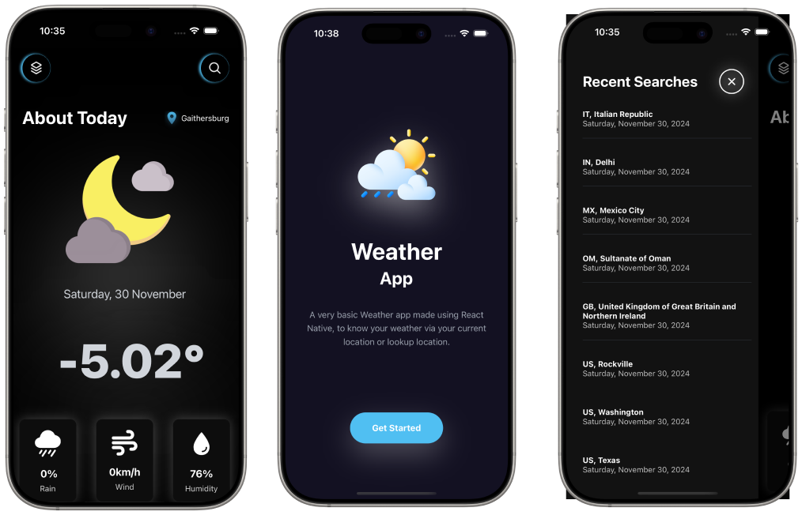
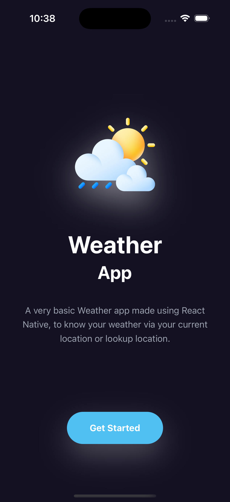
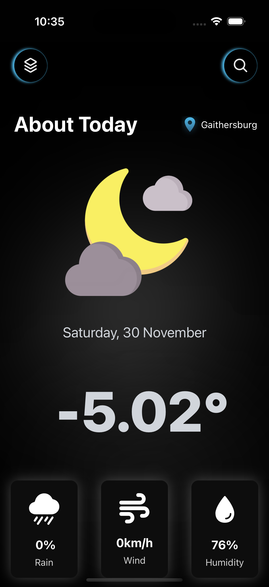
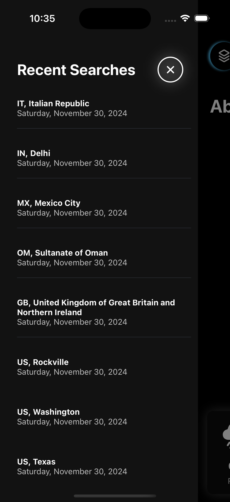
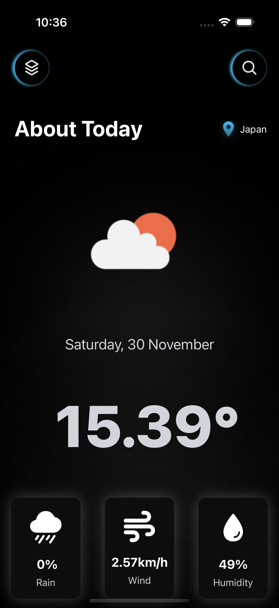
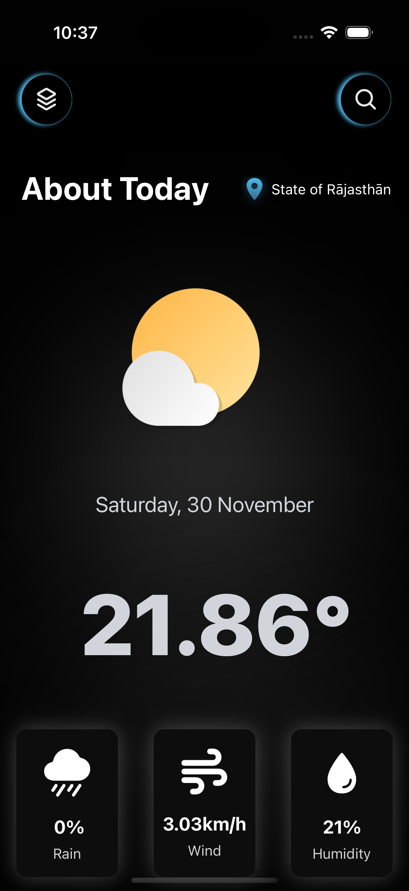
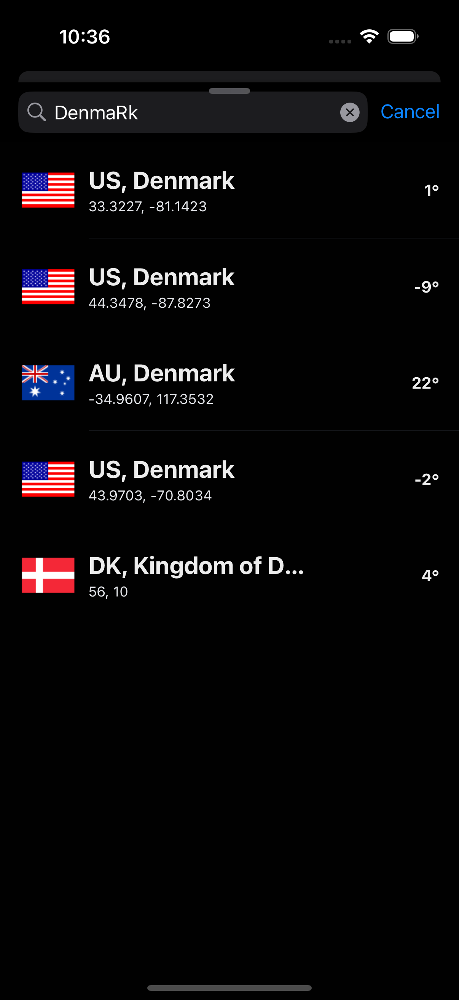

<p align="center">
    <p align="center">
    
    
</p>

<p align="center">
<a href="https://github.com/rit3zh/react-native-weather-app" target="_blank">
    
  </a>
</p>

  <p align="center">
<p align="center">
<a href="https://github.com/rit3zh/react-native-weather-app" target="_blank">
    
  </a>
  <a href="https://github.com/rit3zh/react-native-weather-app" target="_blank">
    
  </a>
  <a href="https://github.com/rit3zh/react-native-weather-app" target="_blank">
    
  </a>
  <a href="https://github.com/rit3zh/react-native-weather-app" target="_blank">
    
  </a>
  <a href="https://github.com/rit3zh/react-native-weather-app" target="_blank">
    
  </a>

</p>

<p align="center">
  <a href="https://www.buymeacoffee.com/rit3zh" target="_blank">
    
  </a>
  
</p>

# Weather App

**React Native Weather** is an open-source, feature-rich weather application designed to provide accurate and up-to-date weather forecasts. With a clean and intuitive user interface, it ensures you always stay informed about the weather conditions in your area and beyond.

## Features 🚀

- **Fetch Default Location**: Automatically detects and displays weather for your current location.

- **Real-Time Weather Data**: Fetches weather updates in real time using the OpenWeather API.

- **Firebase Integration**: Leverages Firebase for real-time data synchronization, including history and search.

- **Search Locations**: Search for weather details of any city or location with instant results.

- **Real-Time History**: Automatically updates your weather search history in real time.

- **User-Friendly Interface**: Minimalistic and responsive design for a seamless experience.

## Screenshots

|                                                                                         |                                                                                         |                                                                                             |
| :-------------------------------------------------------------------------------------: | :-------------------------------------------------------------------------------------: | :-----------------------------------------------------------------------------------------: |
|  |    |  |
|  |  |     |

|

Here's the updated section with a placeholder for the Firebase configuration:

## How to Use the App 🚀

To get started with the WeatherApp, follow these steps:

1. **Clone the Repository**  
   Clone the app's source code:

   ```bash
   git clone https://github.com/rit3zh/react-native-weather-app
   cd react-native-weather-app
   ```

2. **Set Up Environment Variables**  
   Create a `.env` file in the project root with the following content:

   ```env
   EXPO_PUBLIC_USER_SECRET_KEY=<YOUR_USER_SECRET_KEY> #anything unique
   EXPO_PUBLIC_WEATHER_API_KEY=<YOUR_WEATHER_API_KEY> #https://openweathermap.org/
   EXPO_PUBLIC_WEATHER_CURRENT_API_KEY=<YOUR_CURRENT_WEATHER_API_KEY> #Not required
   EXPO_PUBLIC_IP_KEY=<YOUR_IP_API_KEY> #https://ipinfo.io
   ```

   Replace `<YOUR_USER_SECRET_KEY>`, `<YOUR_WEATHER_API_KEY>`, `<YOUR_CURRENT_WEATHER_API_KEY>`, and `<YOUR_IP_API_KEY>` with your own keys.

3. **Configure Firebase**  
   Set up Firebase by creating a `db/index.ts` file and adding the following code:

   ```typescript
   import { initializeApp, FirebaseOptions } from "firebase/app";
   import { getFirestore } from "firebase/firestore";

   const firebaseConfig: FirebaseOptions = {
     apiKey: "<YOUR_API_KEY>",
     authDomain: "<YOUR_AUTH_DOMAIN>",
     projectId: "<YOUR_PROJECT_ID>",
     storageBucket: "<YOUR_STORAGE_BUCKET>",
     messagingSenderId: "<YOUR_MESSAGING_SENDER_ID>",
     appId: "<YOUR_APP_ID>",
     measurementId: "<YOUR_MEASUREMENT_ID>",
   };

   export const app = initializeApp(firebaseConfig);
   export const db = getFirestore(app);
   ```

   Replace placeholders like `<YOUR_API_KEY>` with your Firebase configuration.

4. **Install Dependencies**  
   Install all required packages:

   ```bash
   npm install
   ```

5. **Run the Application**:

   ```bash
   yarn start --reset-cache
   ```

6. **Explore the App**
   - Access real-time weather updates.
   - Search for weather in other cities.
   - Check your weather search history.

---

### ⭐ Consider leaving a Star if you like this repository. ⭐
